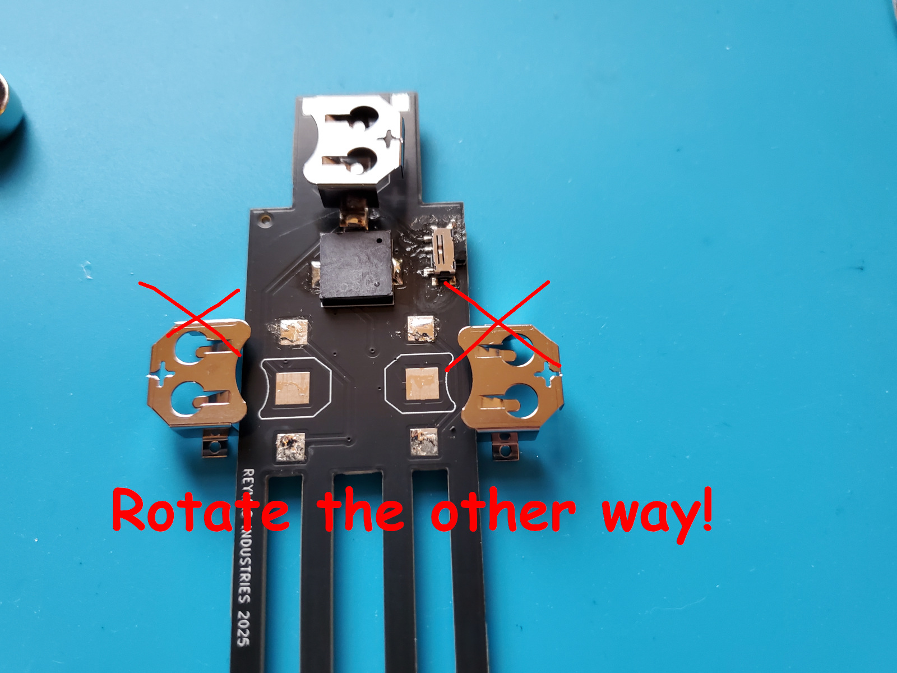

# Annoying Thereman - light sensitive buzzing companion

This repo contains the design and build info for Thereman, a light sensitive buzzing companion.  Very useful for a variety of buzzing sounds.

The Thereman contains two LDRs (Light Dependent Resistors) and a dual 555 timer pretty much like an Atari Punk Console.  The LDRs control pitch and pulse width.

# Build

The kit contains a PCB with the dual 555 timer (a 556), the LDRs, eye LEDs, and some passive components on the front.  The back requires soldering a couple components.  I'm assuming you're using regular solder wire.

## Prep

Tin the pads first.  Shown below, tin the pads marked in green.  The pads in red should not be tinned.

Optionally: if you'd like a loop of wire to hang the Thereman from, tin the yellow pads.  These are not electrically connected.  You can solder a wire to one or between them to create a loop.

Just a touch of solder for tinning please.  And you don't want solder poking up.  Keep it flat and level so components lay flat.

## Switch

The switch has a few small pads; it's easiest to do this first before the other components clutter the space.  The on/off switch sticks out the side of the Thereman.

Once done congrats!  You've soldered the smallest component of the project.  Everything else ought to be easy.

## Piezo Buzzer

The piezo buzzer is the black square that is responsible for the great sound of the Thereman.  It goes in the very middle; it's not polarized and can be installed in either direction.

## Battery Retainers

Install the top battery retainer.  Two of the three pads keep the battery retainer in place and make an electrical connection.  The middle pad is not soldered.  Of the two pads to solder, the pad that is at the top may be easiest to do first.  Then the pad right next to the piezo.

The bottom two battery retainers need to be oriented so one can insert batteries.

Also, keep the battery retainers slightly apart so they do not touch.

## Cleaning

A bit of isopropyl alcohol can be used for cleaning.  Try not to get alcohol in the switch or the piezo buzzer.

## Flip the switch!

With batteries installed (positive side facing up in retainer) flip the switch.  Your Thereman should now start annoying!
